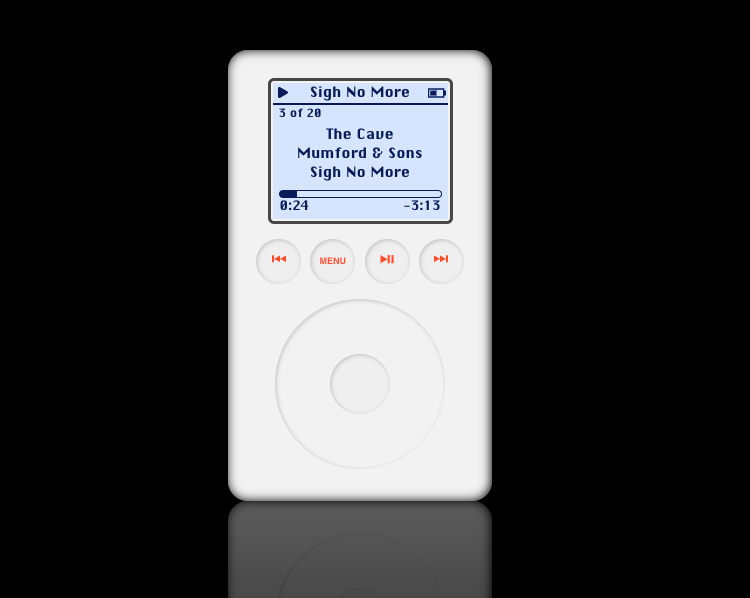

# Ipod Classic



## Development

For development, you'll have to export two environmental variables in order for authorization
to work correctly. This can be easily done by adding a `.env.local` file in the root directory
with the following:

```
REACT_APP_SPOTIFY_CLIENT_ID=YOUR-CLIENT-ID
REACT_APP_SPOTIFY_REDIRECT_URI=http://localhost:3000/callback
```

You can register for your own client ID on the [Spotify Developers Site](https://developer.spotify.com/dashboard/).

In the project directory, you can run:

### `yarn start`

Runs the app in the development mode.\
Open [http://localhost:3000](http://localhost:3000) to view it in the browser.

The page will reload if you make edits.\
You will also see any lint errors in the console.

### `yarn test`

Launches the test runner in the interactive watch mode.\
See the section about [running tests](https://facebook.github.io/create-react-app/docs/running-tests) for more information.

## Acknowledgements

This project was bootstrapped with [Create React App](https://github.com/facebook/create-react-app).
